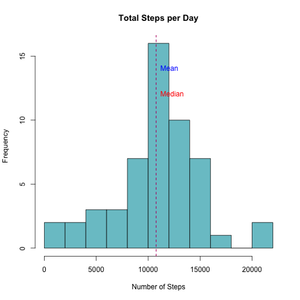

## Loading and preprocessing the data

The raw data is provided as a ZIP archive, so we can read it easily:

```r
df <- read.csv(unz("repdata_data_activity.zip", "activity.csv"))
```

Let's see how many incomplete entries (containing NA values) we have:

```r
is_complete <- complete.cases(df)
num_complete_entries <- length(is_complete[is_complete == TRUE])
num_incomplete_entries <- length(is_complete[is_complete == FALSE])

slices <- c(num_complete_entries, num_incomplete_entries)
labels <- c("Complete:", "Incomplete:")
labels <- paste(labels, c(num_complete_entries, num_incomplete_entries))
pie(slices, labels=labels, col=c("cadetblue3", "coral"))
```

 

We can now consider only the complete cases:

```r
df.complete <- subset(df, complete.cases(df) == TRUE)
```

## What is mean total number of steps taken per day?

After adding all the steps per day, we can compute mean and median:

```r
require("dplyr")
steps_per_day <- df.complete %>%
           group_by(date) %>%
           summarise(total.steps = sum(steps))

mean_per_day <- mean((steps_per_day$total.steps))
mean_per_day
```

```
## [1] 10766.19
```

```r
median_per_day <- median((steps_per_day$total.steps))
median_per_day
```

```
## [1] 10765
```

Visually, we have:

```r
hist(steps_per_day$total.steps, breaks = 10,
     main = "Total Steps per Day", xlab = "Number of Steps",
     col="cadetblue3")
abline(v = mean_per_day, lty = 2, col = "blue")
text(mean_per_day, 14, labels = "Mean", col = "blue", pos = 4)
abline(v = median_per_day, lty = 2, col = "red")
text(median_per_day, 12, labels = "Median", col = "red", pos = 4)
```

 

## What is the average daily activity pattern?

We can now summarise the complete data, aggregated by interval, and compute the
mean:

```r
daily_mean <- summarise(group_by(df.complete, interval), mean(steps))
df.daily_mean <- data.frame(daily_mean)
names(df.daily_mean) <- c("interval", "steps")

max_index <- which.max(df.daily_mean$steps)
max_steps <- round(df.daily_mean$steps[max_index])
max_interval <- df.daily_mean$interval[max_index]
```

We have that the maximum number of steps and its 5-minute interval are:

```r
max_steps
```

```
## [1] 206
```

```r
max_interval
```

```
## [1] 835
```

Visually:

```r
with(df.daily_mean,
     plot(interval, steps, type="l", xaxt="n", col="blue4",
          main="Average Daily Activity Pattern",
          xlab="5-minute interval", ylab="Average number of steps"))
axis(1, at=seq(100, 2300, by=100), las=2)
abline(v=max_interval, lty=5, col="brown4")
text(max_interval, max_steps,
     labels = paste("max = ", as.character(max_steps),
                    "steps, interval #", max_interval),
     pos=4, col="brown4")
```

 

## Imputing missing values

As we have seen, the total number of incomplete entries is:

```r
num_incomplete_entries
```

```
## [1] 2304
```

We can fill each of them with the mean across all days for the same interval:

```r
average_steps_per_interval <- mapply(function(x, y) {
  if (is.na(y)) {
    y <- df.daily_mean$steps[df.daily_mean$interval == x]
  }
  y},
  df$interval, df$steps)
df.imputed <- data.frame(df$date, average_steps_per_interval)
names(df.imputed) <- c("date", "steps")

steps_per_day.imputed <- df.imputed %>%
           group_by(date) %>%
           summarise(total.steps = sum(steps))

mean_per_day.imputed <- mean((steps_per_day.imputed$total.steps))
median_per_day.imputed <- median((steps_per_day.imputed$total.steps))

hist(steps_per_day.imputed$total.steps, breaks = 10,
     main = "Total Steps per Day (imputed)", xlab = "Number of steps",
     col="chartreuse3")
abline(v = mean_per_day.imputed, lty = 2, col = "blue")
text(mean_per_day.imputed, 14, labels = "Mean", col = "blue", pos = 4)
abline(v = median_per_day.imputed, lty = 2, col = "red")
text(median_per_day.imputed, 12, labels = "Median", col = "red", pos = 4)
```

 

We can now compare the original values against the new data set with imputed values:

```r
par(mfrow=c(1, 2))

# Original values
hist(steps_per_day$total.steps,
     main="Total steps per day", xlab = "Number of steps",
     col="cadetblue3", ylim=c(0,40))
abline(v=mean_per_day, lty = 2, col = "blue")
text(mean_per_day, 20, labels = "Mean", col = "blue", pos = 4)
abline(v=median_per_day, lty = 2, col = "red")
text(median_per_day, 10, labels = "Median", col = "red", pos = 4)

# Imputed values
hist(steps_per_day.imputed$total.steps,
     main="Total steps per day (imputed)", xlab = "Number of steps",
     col="chartreuse3", ylim=c(0,40))
abline(v = mean_per_day.imputed, lty = 2, col = "blue")
text(mean_per_day.imputed, 20, labels = "Mean", col = "blue", pos = 4)
abline(v = median_per_day.imputed, lty = 2, col = "red")
text(median_per_day.imputed, 10, labels = "Median", col = "red", pos = 4)
```

 

```r
summary(steps_per_day$total.steps)
```

```
##    Min. 1st Qu.  Median    Mean 3rd Qu.    Max. 
##      41    8841   10760   10770   13290   21190
```

```r
summary(steps_per_day.imputed$total.steps)
```

```
##    Min. 1st Qu.  Median    Mean 3rd Qu.    Max. 
##      41    9819   10770   10770   12810   21190
```

By filling missing values using the averaged values from the same intervals, both
the mean and the median are essentially the same. However we have an effect on the
histogram, e.g. the number of observation.

## Are there differences in activity patterns between weekdays and weekends?

We first create a factor telling whether we're processing weekend or weekday data,
when we summarise our data based on that factor:

```r
library("lubridate")

is_weekend <- weekdays(ymd(df.imputed$date)) %in% c("Saturday", "Sunday")
which_day <- vector("character", length=length(is_weekend))
which_day[is_weekend] <- "weekend"
which_day[!is_weekend] <- "weekday"
which_day.factor <- factor(which_day)

df.which_day <- data.frame(df, which_day.factor, average_steps_per_interval)

df.which_day.summarised <- data.frame(summarise(group_by(df.which_day, interval,
                                                         which_day.factor),
                                                mean(average_steps_per_interval)))
names(df.which_day.summarised) <- c("interval", "day_type", "steps")
df.weekdays <- subset(df.which_day.summarised, day_type == "weekday")
df.weekends <- subset(df.which_day.summarised, day_type == "weekend")
```

Finally we can compare the two time series in a panel plot:

```r
library("lattice")

xyplot(steps ~ interval | day_type, data = df.which_day.summarised,
       type="l", col="blue4", layout=c(1,2),
       mean="Average steps on weekends and weekdays",
       xlab="5-minute interval", ylab="Number of steps")
```

 
